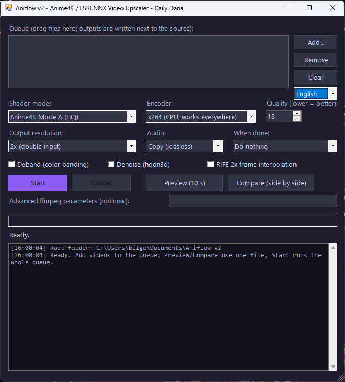

# Aniflow

**Anime4K / FSRCNNX video upscaler GUI with optional RIFE 2x frame interpolation — by Daily Dana**

A portable, single-file PowerShell/WinForms app for Windows that permanently applies
mpv-style GLSL shader chains (Anime4K, FSRCNNX) to video files using FFmpeg's
`libplacebo` filter, with hardware encoding (Intel QSV / NVIDIA NVENC / AMD AMF) and
an optional [RIFE](https://github.com/hzwer/Practical-RIFE) AI frame-interpolation
stage that doubles the frame rate (24 → 48 fps).

<!--  -->

## Features

- **Batch queue** — drag & drop files or folders; outputs are written next to the
  source (`name_2x_upscale.mkv`, `name_2x_rife_upscale.mkv`).
- **11 shader presets** — Anime4K modes A/B/C, double modes (A+A, B+B, C+A),
  Adaptive Sharpen variants, FSRCNNX x2 16/8 + KrigBilateral.
- **RIFE 2x frame interpolation** (optional) — runs at source resolution via
  VapourSynth before the shader upscale; scene-change aware, audio/subtitles preserved.
- **Output scaling** — 2x/3x/4x multipliers or 1080p/1440p/2160p targets.
- **Preview** — process 10 seconds from the middle of the video and play it.
- **Compare** — classic Lanczos vs. shader chain, side by side in one video.
- **Encoders** — x264/x265 (CPU), H.264/HEVC/AV1 QSV, NVENC, AMF.
- Optional deband + denoise filters, audio copy or AAC/Opus re-encode,
  post-queue actions (sound / sleep / shutdown), sleep inhibited while encoding.
- Dark themed UI (Turkish).

## Requirements

- Windows 10/11 with PowerShell 5.1 (built in)
- A GPU with Vulkan drivers (for libplacebo shaders; virtually anything post-2015)
- **For RIFE only (optional):** Python 3.12+ with `pip install vapoursynth`

## Install

```powershell
git clone https://github.com/DailyDana/Aniflow.git
cd Aniflow
.\setup.ps1        # downloads ffmpeg (BtbN official build) + RIFE dependencies
```

Then double-click **`Aniflow.bat`**.

`setup.ps1` fetches what the repo does not ship: `bin\ffmpeg.exe` straight from the
official [BtbN FFmpeg builds](https://github.com/BtbN/FFmpeg-Builds) and the
VapourSynth pieces (BestSource + RIFE ncnn Vulkan plugin + v4.6 model) from this
repo's `deps-v1` release.

## Usage notes

- Hardware encoders depend on your GPU (QSV = Intel, NVENC = NVIDIA, AMF = AMD).
  If one fails, the log shows the ffmpeg error — fall back to x264.
- 10-bit sources: pick HEVC or AV1 (H.264 QSV cannot encode 10-bit).
- With RIFE enabled the progress bar may sit at 0% for a few seconds while the
  VapourSynth pipeline warms up — this is normal.
- The RIFE checkbox is disabled (with the reason in the log) when `vspipe`,
  the RIFE plugin, or `bestsource.dll` is missing.
- Quick health check: `powershell -File Aniflow.ps1 -SelfTest`

## License

MIT © 2026 Daily Dana — see [LICENSE](LICENSE).
Bundled/downloaded third-party components (Anime4K, FSRCNNX, KrigBilateral,
adaptive-sharpen, FFmpeg, VapourSynth, BestSource, RIFE) keep their own licenses —
see [THIRD-PARTY.md](THIRD-PARTY.md).

---

## Türkçe

**Anime4K / FSRCNNX shader zincirlerini videoya kalıcı uygulayan taşınabilir Windows
aracı; isteğe bağlı RIFE 2x kare interpolasyonu ile. Yazar: Daily Dana.**

- **Kurulum:** depoyu klonlayın, `.\setup.ps1` çalıştırın (ffmpeg'i resmi BtbN
  yapımından, RIFE bağımlılıklarını bu deponun `deps-v1` release'inden indirir),
  ardından **`Aniflow.bat`** ile başlatın.
- **RIFE için (isteğe bağlı):** Python 3.12+ kurup `pip install vapoursynth` yapın.
  Eksik parça varsa RIFE kutusu kapalı kalır, sebebi log penceresinde yazar.
- **Kullanım:** dosyaları kuyruğa sürükleyin; shader modunu, kodlayıcıyı ve
  çözünürlüğü seçin; Önizleme videonun ortasından 10 sn işler, Karşılaştır klasik
  ölçekleme ile shader'ı yan yana gösterir. Çıktılar kaynak dosyanın yanına yazılır.
- Donanım kodlayıcılar GPU'ya bağlıdır; hata verirse x264'e geçin. 10-bit
  kaynaklarda HEVC/AV1 seçin. RIFE başlarken ilerleme çubuğunun birkaç saniye
  %0'da beklemesi normaldir.
- Ayrıntılı özellik listesi için yukarıdaki İngilizce bölüme, üçüncü taraf
  lisansları için [THIRD-PARTY.md](THIRD-PARTY.md) dosyasına bakın.
